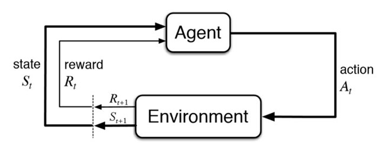

# Overview

Bonsai is a Microsoft Artificial Intelligence platform that allows solving machine learning problems using deep reinforcement learning.  

This platform allows to build Artificial Intelligence components that can provide operator guidance or make independent decisions to optimize process variables, improve production efficiency, and reduce downtime. 

The intelligence is provided by Bonsai and the whole process to infer it is hidden from the programmer. This platform is currently in preview, which means it is not yet suitable for production applications. 

**Reinforcement learning** is a kind of machine learning method in which an agent interacts and learns from the environment.  

The behavior is as follows: first, the agent chooses an action (At), then the environment provides a reward for the performed action (Rt) and the current state (St) and, finally, the environment gets a new state (St+1). The agent will choose actions based on a defined policy, with the reward being positive if the agent gets closer to a desired state, or negative otherwise. The main objective of reinforcement learning is for the agent to choose the best action in each state to maximize the cumulative reward (i.e., to find the optimal policy). This algorithm is a Markov process. This means that both the reward and the next state depend only on the current state and the action taken; the previous states are not taken into account. 

**Deep reinforcement learning** is the combination between reinforcement learning and deep learning. This improves performance against problems that commonly arise in reinforcement learning algorithms, since it allows agents to make decisions from unstructured input data without manual engineering of the available states. The most popular algorithm is Deep Q-learning based on the Q-learning algorithm used in reinforcement learning. This algorithm uses a neuronal network in which the input is the environment’s state and the output is the Q-value for each possible action. This Q-value is composed by the state, the action and the network parameters.

[Continue reading..](../02-bonsai-architecture/README.md)
