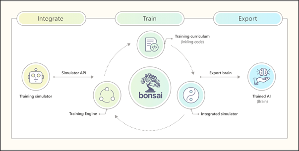

# Bonsai Architecture
In this section we explain the main components and workflow behind Bonsai. For more information, refer to the [official documentation](https://docs.microsoft.com/en-us/bonsai/product/components/simulation).

## Integrate
Bonsai uses simulations and **Deep Reinforcement Learning (DRL)** to train AI models. These simulations define the environment in which a model will act and they can be custom-made or obtained from popular simulator software.

Bonsai supports MATLAB Simulink, AnyLogic and custom dockerized containers, as well as API support (REST and Python).

Bonsai usually works with any simulation with a defined initial state that iterates over time and responds to external actions. However, Bonsai tends to work better with simulations that have the following characteristics:
* An acceptable degree of similarity to a real-world scenario.
* The ability to visualize useful data while training.
* A well-defined environment state that is accessible at each step of the simulation.
* A customizable initial configuration so that the brain can learn from different environment conditions.
* A set of discrete actions or a range of continuous actions that the brain can take to affect the state.
* The ability to determine when the system gets into a successful state, meeting the requirements, and when it gets into a state where further progress is impossible.

Bonsai does not work well for multi-agent scenarios because when the user has different agents that perform actions in the same environment, the brain cannot identify which agent is the brain and which agent acts in the simulation.

## Train
The training part of Bonsai is composed of three main components: brains, a training engine, and goals and objectives.

### Brains
Bonsai brains are trained AI models with the ability to intelligently control and optimize real-world systems. Once trained, these brains can be integrated with simulators that model the real-world systems where they are meant to act.

### Training engine
Bonsai has a training engine with four key components: architect, instructor, learner, and predictor.

The architect creates and optimizes learning topologies based on the training curriculum, which is defined by code written in a language called [Inkling](https://docs.microsoft.com/en-us/bonsai/inkling/). It evaluates the different algorithms available for the problem being addressed and chooses the most appropriate one, considering the topologies that have the best chance at learning the concepts in the model. This code defines what and how to teach the AI system. The Architect supports three different learning algorithms: Distributed Depp Q Network (APEX), Proximal Policy Optimization (PPO) and Soft Actor Critic (SAC).

The instructor coordinates training for the learner based on the curriculum and training data provided by the simulation. It responds in real time as the learner iterates through the process of receiving data, computing a response, being assessed, and learning from the results.

The learner gains experience at solving the machine learning problem based on direction provided by the Instructor and using the algorithms selected by the architect during training.

The predictor represents the trained brain that can be exported and used in the real world. It reports how the trained learner will behave when given different states. Once exported, the trained brain can be consumed as an HTTP API endpoint so that programmers can send input data to the brain to get a prediction.

### Goals and Objectives (training curriculum)
Goals are a high-level specification of what the user wants the system to learn. The training engine uses these goals to select the best learning algorithm for the brain and then reports on training progress. Inkling is used to encode those objectives into the brain. The user can define an arbitrary number of goals and the training engine will attempt to satisfy them. Both during training and at the end of training the user will be able to see the satisfaction percentage for each goal.

[Continue reading..](../03-creating-and-training-brains/README.md)
