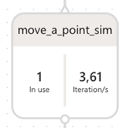

# Creating and training brains
Bonsai allows creating brains, which contain the AI models that will be trained to learn a specific objective. For each brain, different versions can be created. Each version contains an Inkling file, where the brain’s objectives are defined. When a brain is created, it can be trained by binding the desired version with a simulation of the environment where it will act. Following the training process, the brain can be assessed from Bonsai or exported to be used outside Bonsai.

## Episodes and iterations
During the brain’s training, several iterations are made within sequences known as episodes. An episode is defined as all the states that take place between an initial state and a terminal state. Episodes can be seen as the attempts the brain makes to accomplish its objectives, whether they are successful or not.

The user can configure the number of iterations per episode with a specific parameter in the training curriculum’s definition. This number of iterations will depend on the problem that the user is treating. If before reaching this number of iterations the brain reaches a terminal condition, the episode will also end. When an episode starts, the simulator’s state is reset and the initial configuration is re-established.

While the brain is training, the user can see the number of iterations per second that the brain is currently processing, as shown in the image below.

These iterations vary greatly if the brain is executed locally or integrated with Bonsai. If the user runs the brain locally it trains in a range between 1 to 10 iterations per second, while if the user runs the brain integrated with Bonsai a range between 100 and 300 iterations per second are trained. More details on this can be found in the [Simulators](#simulators) section.

## Inkling file
The Inkling file defines what and how to teach a brain what it is meant to learn. This file contains a series of key components, which are defined as data types and keywords. Below, we illustrate this with the [Moab sample](https://docs.microsoft.com/en-us/bonsai/quickstart/moab/) provided by Microsoft.

The image below shows two data types that must be defined: the state (ObservableState) and the action (SimAction). The state describes the environment’s status at a given time. The simulator provides its values after each iteration. Based on the input state and the training objectives, the brain returns an action for the simulator to allow the system to move towards its main objective.

The two images below show the graph block, which defines how the system will evolve on each iteration based on the input state. The graph ultimately produces an output that indicates if an episode must start or end, or if it must step forward by performing an action.

This example uses the goal keyword, with which high-level objectives are defined for the entire training process. Alternatively, users can define a reward function that provides a system of points that are added or subtracted on each iteration, depending on the success or failure of each action the brain takes, and a terminal function that indicates when an episode must end.

## Algorithms
Bonsai uses different algorithms to solve problems. Users can choose to let Bonsai select the algorithm automatically or propose one themselves through the Inkling file. If Bonsai’s architect considers that the algorithm proposed by the user is not appropriate for the problem, it will choose a more suitable one. The choice of the algorithm will depend on the types of actions that are configured in the Inkling file. Bonsai supports the following algorithms:
* Distributed Depp Q Network (APEX) used for discrete action spaces (ordinal or nominal). More information about this algorithm can be found [here](https://www.tensorflow.org/agents/tutorials/0_intro_rl).
* Proximal Policy Optimization (PPO) used for continuous and discrete ordinal action spaces. More information about this algorithm can be found [here](https://openai.com/blog/openai-baselines-ppo/#ppo).
* Soft Actor Critic (SAC) used for continuous and discrete ordinal actions spaces. More information about this algorithm can be found [here](https://spinningup.openai.com/en/latest/algorithms/sac.html#exploration-vs-exploitation).

In addition to selecting the algorithm, the user can configure some of its parameters. More specific information about the configuration of the algorithms can be read [here](https://docs.microsoft.com/en-us/bonsai/inkling/advanced/algorithm).

## How to create a new brain
To create the brain, the user must select the *Create Brain* button from Bonsai’s home page, as shown in the image below. 

Users can choose to start from an empty brain or from a built-in sample. The image below shows the corresponding dialog, with *Cartpole sample* and *Moab sample* being the built-in samples.

When the user selects *Empty Brain*, they will only be required to fill in the brain’s display name.

The user can find the brain under the *Brains* section in the left menu and complete an empty Inkling file, in which the brain’s objectives must be provided. Users can create multiple versions of a brain, making modifications to the Inkling file.

## Simulators
A simulator is a virtual environment that provides the same behavior as a specific object in the real world. The simulator has an observable state, which provides information to the brain regarding the simulator’s status at a given moment. The simulator gets an action from the brain, acts based on this action, which modifies its state, and sends the new state back to the brain for it to calculate the next action.

To build a simulator, it is necessary to accurately define the environment in which the brain will act. The simulator must be able to perform the actions indicated by the brain in this environment.

When a simulator is connected to a Bonsai brain and the training process begins, the brain sends a series of events to the simulator to indicate when an episode starts, when the simulator must carry out an additional step and when an episode ends.

### Running a local simulator
The user can run the simulator locally and connect it to a Brain hosted by Bonsai.
To connect this simulator with Bonsai, the user must add specific connection strings to their local project and run it. Once the project is running, it should appear as an unmanaged simulator under Simulators on the left menu, as shown in the image below.

To connect the brain with the simulator, the user must select the desired brain version and, within the *Train* panel, click the *Train* button, as the image below shows.

A dialog with the available simulators shows, from which the user must select their simulator.

Once the brain is connected to the simulator, the training process starts.

Multiple simulators can be connected to the same brain. To do so, an additional instance of the local simulator must be run. Once it is running, the simulator appears in Bonsai in the list of unmanaged simulators. The simulator’s session ID must be obtained by selecting the simulator as shown in the image below. This ID allows connecting the brain with the simulator using the Bonsai CLI.

Then the user has to execute the following sentence:

The *session-id* argument is the session ID explained above, *brain-name* is the name of the brain to train, and *action* indicates whether the brain will be trained or assessed, with the values *Train* or *Assess*, respectively. Running the *bonsai simulator unmanaged connect –help* sentence shows additional arguments that can be used. The image below shows two unmanaged simulators in the *Simulators* panel. The diagram on the right shows effectively shows that there are two simulators in use. More information about the connection can be found [here](https://docs.microsoft.com/en-us/bonsai/cli/simulator/unmanaged/connect).

When the simulator is running remotely, hosted by Bonsai, the user can also connect a local simulator using the previous steps. This is very useful if they want to see training progress with a UI or get training logs.

### Running a remote simulator
The user can run the simulator remotely. As mentioned before, the main advantage of running the simulator remotely is the training speed, which is much faster than running it locally.

There are two ways to accomplish this: using Docker or using the Azure CLI.
* Docker: the user can create a local Docker image and then push it to an Azure Container Registry. More information about this process can be found [here](https://docs.docker.com/develop/develop-images/dockerfile_best-practices/).
* Azure CLI: the user can directly push the Docker image to the Azure Container Registry, without storing the Docker image locally. More information about how to do this can be found [here](https://docs.microsoft.com/en-us/bonsai/guides/add-simulator?tabs=add-cli%2Ctrain-inkling&pivots=sim-platform-other).

Once the simulator Docker image has been added to the Azure Container Registry associated with the current workspace, the user can bind this image with the Bonsai platform. To do so, Add sim must be selected from the Simulators panel. The image below shows this.

Then, a dialog will be displayed with different ways to add a simulator depending on the platform in which it was implemented. The possible options are *MathWorks Simulink*, *Anylogic* or *Other*.

This research is based on Python simulators; for this reason the user must choose the *Other* option.

Finally, upon clicking on the *Other* button, a dialog box is opened which prompts the user to fill in the following information:
* The path where the Docker image is located.
* The simulator name displayed in Bonsai.
* The operating system
* The maximum number of running container.
* The cores.
* The memory.

Once the data has been filled in and the Create simulator button has been selected, the user will be able to see the simulator in the Simulators section of the left menu. Upon selecting a version corresponding to a particular brain, the user can access the Train panel and click the Train button. The user will be prompted to select one of the available simulators to execute the training process.

### Advantages and disadvantages of using local or remote simulator
Executing the simulator locally, the user can test its performance, using different logs or debugging the code. Additionally, a simulator can include a graphical interface to easily validate the system’s behavior. However, local simulations are quite slow, typically ranging from 2 to 4 iterations per second.

When simulators are executed remotely, training progress can only be seen in the form of different graphs provided by Bonsai, without access to the graphical interface (if the simulator includes one) but the simulation runs much faster: from 100 to 300 iterations per second. The best way to train the simulator would be to check the correct connection and behavior locally and then add the simulator to Bonsai and run it remotely. Given its much lower speed, running a simulator locally should be limited to debugging or visually validating part of the training process. Attempting to perform the entire training process with a locally running simulator would be extremely impractical.

[Continue reading..](../04-assessments-on-trained-brains/README.md)
