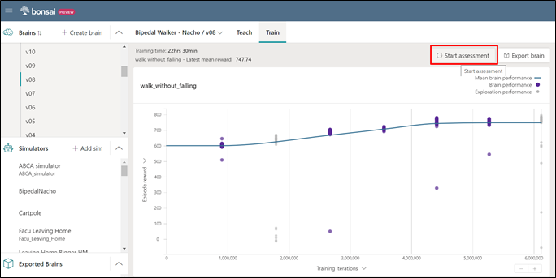
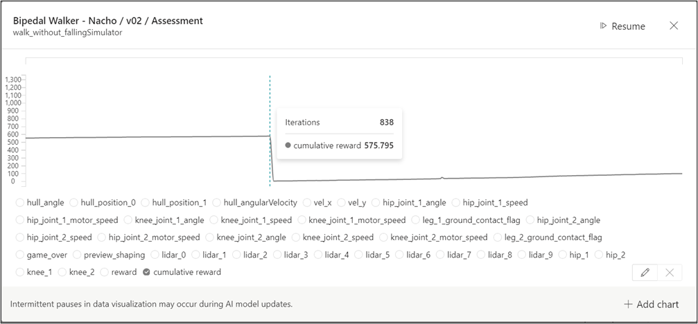

# Assessments on trained brains
Once a brain is trained, it can be evaluated to find how well it has learnt the training curriculum. The *assessment* feature allows connecting the brain that is hosted on Bonsai to a local or remote simulator and viewing results in real time.

Assessments can be run on trained or partially trained brains. This means that they can be used after the training process automatically ends or after manually stopping it once the user is satisfied with the performance metrics.

To run an assessment through the Bonsai portal, the user must select the desired brain version from the *Brains* section of the left menu and, within the *Train* panel, click the *Start assessment* button, as shown in the image below.

This displays a graph viewer in which the user can select any state variable (multiple variables can be selected at once) and watch their evolution as iterations pass. The assessment runs as long as the simulator is running. This means that if the simulator runs as an infinite loop where multiple episodes can occur, the assessment graphs will continue to capture data and the user will watch multiple episodes start and finish.

The image below shows an example of the assessment graph viewer where the plotted variable is the *cumulative reward*. This is the sum of the reward value across a single episode. The moment where the cumulative reward drops drastically and starts growing correspond to the end of an episode and the start of a new one. The rest of the variables are state variables specific to the brain. Any of them can be selected and, if multiple are chosen at once, their plots will overlap.

The information these graphs show can be useful to assess if the brain reaches target values for specific state variables, goals or reward values. Also, in certain cases the information can be used to compare different versions of a brain (for instance, if one reached a certain value for a state variable, how many iterations it took to reach that value, etc.).

[Continue reading..](../05-exporting-brains/README.md)
