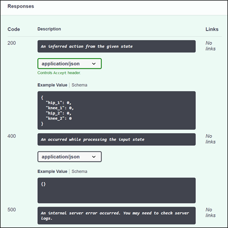

# Exporting brains

Once the user is satisfied with the assessment’s results, they can export the brain as a containerized service that runs on Docker. The container exposes the service with the trained brain as a REST API, which can be used from different languages and REST libraries.

## How to export a brain as a Docker image
To export a brain, the desired brain version must be selected from the left menu under *Brains* and, within the *Train* panel, the *Export brain* button must be clicked. The image below shows this.

Upon clicking the *Export brain* button, a dialog box is opened which prompts the user to fill in the following information:
* Name of the exported brain
* Operating system the brain will run on
* Processor architecture the brain will run on

Once the required information is given, the brain appears under Exported Brains on the left menu and begins the export process. When it is done exporting, a new dialog is shown which indicates a series of commands to obtain the Docker container. The image below shows this last dialog.

An image of the exported brain is packaged as a Docker container and saved to the Azure Container Registry associated with the current workspace. The *docker pull* command pulls the image from the ACR to the local Docker environment. Then the container is run with the *docker run* command. The *-d* flag (*detach*) allows the container to run without blocking the terminal, while the *-p* flag (*publish*) routes traffic on port 5000 of the container to port 5000 of the local machine (localhost:5000).

## Consuming an exported brain
Once the brain container is running, users can communicate with it programmatically using the *POST /v1/prediction* endpoint. The container will serve API details for the brain at *http://localhost:5000/v1/doc/index.html*. Here, Swagger documentation is displayed, where the expected request and response bodies are shown. With this information, applications can be built using REST clients/libraries to interact with the API and obtain actions for given input states. The following two images show sections of the Swagger documentation for a specific trained brain.

The container can also be run from a cloud-based service, in which case localhost should be replaced by the service’s base URL. 

[Continue reading..](../06-explored-scenarios/README.md)
