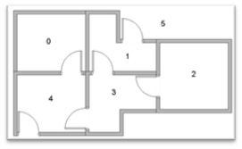
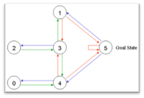
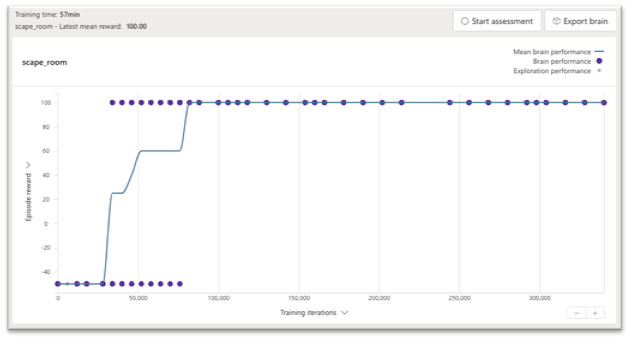
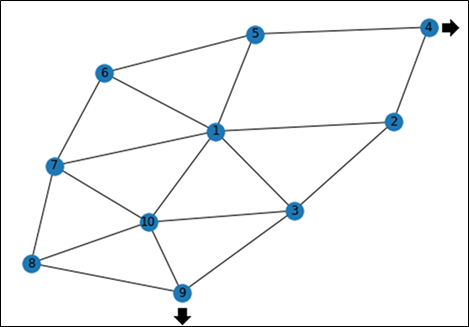

# Leaving Home scenario
## Small house version
### Scenario description
The initial scenario consists of a home with five rooms and one exit. An agent is placed in one of the rooms and its goal is to find the exit. The agent is only allowed to move from one room to the next if they are connected.





### State definition
Due to the simplicity of the scenario, the current system state could be defined by a single integer number indicating the number of room the agent is currently in.

However, Bonsai requires the reward function to be calculated based on the current system state. Therefore we need to add a second variable to the system state with a boolean value indicating if the last action taken by the brain is invalid (the model tried to move to a non-adjacent room). By adding this variable we will be able to give the algorithm a negative reward (and terminate the episode) if it tries to perform an invalid move.

```
type Rooms number<0, 1, 2, 3, 4, 5>

type State {
    room: Rooms,
    wrong_room: Number.Bool
}
```

### Actions definition
Each action taken by the system can be defined using a single integer number indicating which room the agent decided to move to.

```
type Rooms number<0, 1, 2, 3, 4, 5>

type Action {
    new_room: Rooms
}
```

### Reward function
These are our reward and terminal functions to promote the agent to reach the exit while avoiding making invalid moves:
```
function Reward(obs: State, act: Action) {
    if(obs.wrong_room) {
        return -50
    } else if(obs.room == 5) {
        return 100
    } else {
        return 0
    }
}

function Terminal(obs: State, act: Action){
    return obs.wrong_room or obs.room == 5
}
```

### Results
Using this model we were able to train the brain to reach the exit from any initial room in approximately 100.000 iterations as seen in the image below.



## Large house version
After reaching good results in the small house version, we made the scenario more complex by making the house larger.

### Scenario description changes
We created a layout of ten rooms and an exit. The image below shows a visual representation in the form of a graph that shows the 10 rooms and indicates that rooms number 4 and 9 are connected to the exit.



### State definition changes
We originally tried to keep the same state definition as in the previous case (room and wrong_move). Using this state definition worked but the training process took significantly longer than with the small house scenario (1 million iterations instead of 100.000). This is probably due to the fact that increasing the number of rooms in the house increases the probability of the model trying to make invalid moves.

To accelerate training, we incorporated additional information in the system state, letting the agent know which rooms are adjacent to the current room:
```
type Rooms number<0, 1, 2, 3, 4, 5, 6, 7, 8, 9, 10>

type State {
    room: Rooms,
    wrong_room: Number.Bool,
    available_rooms: {
        room0: Number.Bool,
        room1: Number.Bool,
        room2: Number.Bool,
        room3: Number.Bool,
        room4: Number.Bool,
        room5: Number.Bool,
        room6: Number.Bool,
        room7: Number.Bool,
        room8: Number.Bool,
        room9: Number.Bool,
        room10: Number.Bool
    }
}
```

### Results
As the previous version, this one was able to reach the exit of the house starting from any of the 10 different rooms. The training took approximately 160.000 iterations.

## Large house: Shortest path version
### Scenario description changes
On our previous versions, the brain was rewarded when reaching the exit but it had no incentive to prioritize short paths. Therefore, in multiple ocassions it took unnecessarily long paths to exit the house. On this version, we decreased the reward the longer the path taken was.

### Reward function change
Taking the shortest path can be easily promoted by giving a negative reward to the agent for each step it takes without reaching the exit:

```
function Reward(obs: State, act: Action) {
    if(obs.wrong_room) {
        return -50
    } else if(obs.room == 0) {
        return 100
    } else {
        return -10
    }
}
```

### Results
This version took around 1.5 million iterations to train, considerably longer than the previous one, but it managed to reach the exit using shorter paths for almost all starting rooms:

| Start | Shortest path | | Previous version | | Best Path |
--------|---------------|-|------------------|-|-----------|
| 1 |  1 – 2 – 4 – 0 | ✔ | 1 – 7 – 10 – 9 – 0 | ❌ | 1 – 2 – 4 – 0 or 1 – 5 – 4 – 0 |
| 2 | 2 – 4 – 0 | ✔ | 2 – 4 – 0 | ✔ | 2 – 4 – 0 |
| 3 | 3 – 9 – 0 | ✔ | 3 – 9 – 0 | ✔ | 3 – 9 – 0 |
| 4 | 4 – 0 | ✔ | 4 – 0 | ✔ | EXIT |
| 5 | 5 – 4 – 0 | ✔ | 5 – 6 – 7 – 10 – 9 – 0 | ❌ | 5 – 4 – 0 |
| 6 | 6 – 5 – 4 – 0 | ✔ | 6 – 7 – 10 – 9 – 0 | ❌ | 6 – 5 – 4 – 0 |
| 7 | 7 – 6 – 5 – 4 – 0 | ❌ | 7 – 10 – 9 – 0 | ✔ | 7 – 10 – 9 – 0 or 7 – 8 – 9 – 0 |
| 8 | 8 – 9 – 0 | ✔ | 8 – 9 – 0 | ✔ | 8 – 9 – 0 |
| 9 | 9 – 0 | ✔ | 9 – 0 | ✔ | 9 – 0 |
| 10 | 10 – 3 – 9 – 0 | ❌ | 10 – 9 – 0 | ✔ | 10 – 9 – 0 |

## Conclusion
Even though the final version of the model still has room for improvement we consider that this scenario was simple enough (due to having a relatively small state space to explore) to allow the agent getting good results in a relatively short amount of time.

[Continue reading..](../02-bipedal-walker/README.md)
