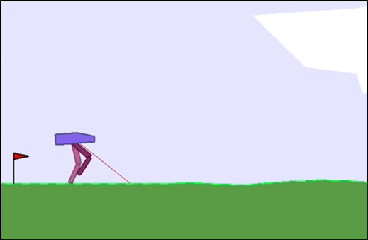
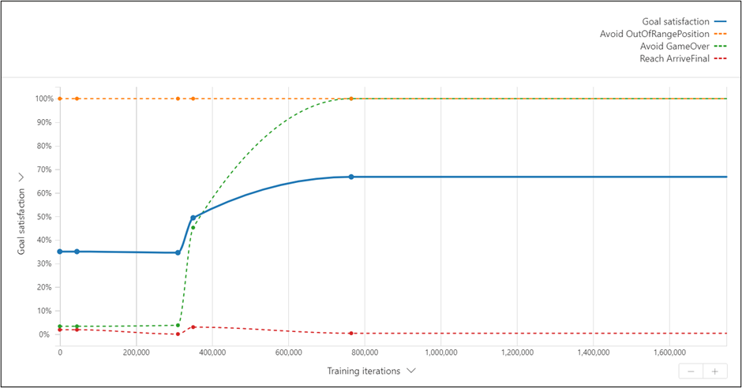
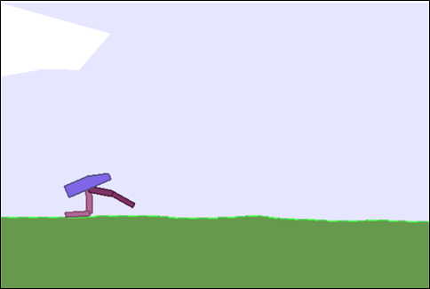
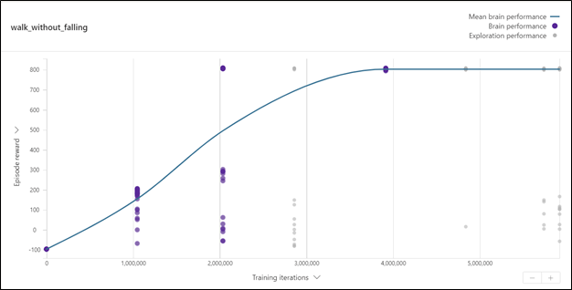
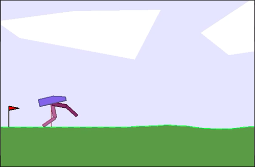

# The Bipedal Walker scenario
## Scenario description
The Bipedal Walker is a standard sample scenario that can be obtained from [OpenAI](https://gym.openai.com/envs/BipedalWalker-v2/), being significantly more complex than the Leaving Home scenario. It consists of a fixed-length plain terrain along in which an agent has to walk from a starting point to an end point. This agent has a hull as a head and two legs with two joints each: one would represent the agent's hip and the other one its knee. Additionally, the agent has a lidar rangefinder. The image below shows the UI with the agent leaving from the starting point marked by the red flag.



## State definition
The state consists of the hull angle, position and angular velocity, the agent velocity in both axis, and the joints angles, speeds and motor speeds. Additionally there are flags indicating if the legs are touching the ground, if the game is over (the agent fell down to the ground) and numbers indicating the range measurements of the lidar.
```
type State {
    hull_angle: number,
    hull_position_0: number,
    hull_position_1: number,
    hull_angularVelocity: number,
    vel_x: number,
    vel_y: number,
    hip_joint_1_angle: number,
    hip_joint_1_speed: number,
    hip_joint_1_motor_speed: number,
    knee_joint_1_angle: number,
    knee_joint_1_speed: number,
    knee_joint_1_motor_speed: number,
    leg_1_ground_contact_flag: number,
    hip_joint_2_angle: number,
    hip_joint_2_speed: number,
    hip_joint_2_motor_speed: number,
    knee_joint_2_angle: number,
    knee_joint_2_speed: number,
    knee_joint_2_motor_speed: number,
    leg_2_ground_contact_flag: number,
    game_over: number,
    preview_shaping: number,
    lidar_0: number,
    lidar_1: number,
    lidar_2: number,
    lidar_3: number,
    lidar_4: number,
    lidar_5: number,
    lidar_6: number,
    lidar_7: number,
    lidar_8: number,
    lidar_9: number
}
```

## Action definition
The action that can be taken by the brain consists of moving its hips and / or knees:
* Hip 1 (Torque/Velocity): value between -1 and 1.
* Knee 1 (Torque/Velocity): values between -1 and 1.
* Hip 2 (Torque/Velocity): values between -1 and 1.
* Knee2 (Torque/velocity): values between -1 and 1.

```
const min_action = -1
const max_action = 1

type Action {
    hip_1: number<min_action..max_action>,
    knee_1: number<min_action..max_action>,
    hip_2: number<min_action..max_action>,
    knee_2: number<min_action..max_action>
}
```

## Reward function
### Using goals
Our first version used Bonsai goals:
* Avoid walking backwards: the position of the hull on the horizontal axis must be greater than 0.
* Avoid falling: the agent must avoid receiving the game_over flag sent by the environment if the agent falls.
* Reach the target position: the horizontal hull position must reach the end of the terrain.
```
goal (State: State) {
    avoid OutOfRangePosition:
        State.hull_position_0 in Goal.RangeBelow(min_position)
    avoid GameOver:
        State.game_over in Goal.RangeAbove(1)
    reach ArriveFinal:
        State.hull_position_0 in Goal.RangeAbove((TERRAIN_LENGTH-TERRAIN_GRASS)*TERRAIN_STEP)
}
```
After completing the training process, we found that within 800,000 iterations all goals were accomplished except for reaching the target position. The agent successfully learned to avoid moving backwards and falling but could not find a way to move forward. The image below shows the satisfaction percentages for each goal as a function of the number of iterations. The blue plot takes the average of all three goals.



We tried making several adjustments to fix this issue without success.

### Using reward and terminal functions: Reach the end point
We then created new versions using reward and terminal functions, instead of goals. Defining the reward function of the model directly allows the user to have more granular control of how the agent is rewarded instead of leaving it up to Bonsai.

After multiple iterations we got to the following reward function that gives rewards when the agent moves forward with its hull straight and penalizes it falling down or going backwards:

```
function Reward(obs: State, act: Action) {
    if obs.game_over or obs.hull_position_0 < 0 {
        return -100
    }

    if obs.hull_position_0 > (TERRAIN_LENGTH-TERRAIN_GRASS)*TERRAIN_STEP {
        return 500
    }
    
    var shaping = 130*obs.hull_position_0/SCALE  # moving forward is a way to receive reward (normalized to get 300 on completion)
    shaping = shaping - 5.0*Math.Abs(obs.hull_angle)  # keep head straight, other than that and falling, any behavior is unpunished

    var r = shaping - obs.preview_shaping

    r = r - 0.00035 * MOTORS_TORQUE * Math.Min(Math.Max(Math.Abs(act.hip_1), 0),1)
    r = r - 0.00035 * MOTORS_TORQUE * Math.Min(Math.Max(Math.Abs(act.knee_1), 0),1)
    r = r - 0.00035 * MOTORS_TORQUE * Math.Min(Math.Max(Math.Abs(act.hip_2), 0),1)
    r = r - 0.00035 * MOTORS_TORQUE * Math.Min(Math.Max(Math.Abs(act.knee_2), 0),1)

    return r
}

function Terminal(obs:State, act: Action) {
    return obs.game_over or obs.hull_position_0 < 0 or
obs.hull_position_0 > (TERRAIN_LENGTH-TERRAIN_GRASS)*TERRAIN_STEP
}
```

With this reward function we managed to get the agent to reach the end of the terrain without falling. However, it did so in an awkward manner, dragging one leg on the floor, as illustrated in the image below.



We can see that the cumulative reward stabilizes after 4 million iterations:



### Using reward and terminal functions: Keep hull high
After a few more versions, we managed to avoid the agent dragging its knees by adding a reward for keeping its hull above a predefined coordinate:
```
function Reward(obs: State, act: Action) {
    if obs.game_over or obs.hull_position_0 < 0 {
        return -100
    } else if obs.hull_position_0 > (TERRAIN_LENGTH-TERRAIN_GRASS)*TERRAIN_STEP {
        return 500
    } else {
        var shaping = 130*obs.hull_position_0/SCALE  # moving forward is a way to receive reward (normalized to get 300 on completion)
        shaping = shaping - 5.0*Math.Abs(obs.hull_angle)  # keep head straight, other than that and falling, any behavior is unpunished

        var r = shaping - obs.preview_shaping

        r = r - 0.00035 * MOTORS_TORQUE * Math.Min(Math.Max(Math.Abs(act.hip_1), 0),1)
        r = r - 0.00035 * MOTORS_TORQUE * Math.Min(Math.Max(Math.Abs(act.knee_1), 0),1)
        r = r - 0.00035 * MOTORS_TORQUE * Math.Min(Math.Max(Math.Abs(act.hip_2), 0),1)
    r = r - 0.00035 * MOTORS_TORQUE * Math.Min(Math.Max(Math.Abs(act.knee_2), 0),1)

        if obs.hull_position_1 >= 5 {
            r = r + 0.1
        } else {
            r = r - 0.1
        }

        return r
    }
}
```
With these modifications, the agent is able to reach the end without crawling or dragging a leg on the floor by staying in a mostly upright position throughout the process. However, it still does not walk in a natural way since its legs never alternate: one always leads and, when the other one gets closer, the agent hops forward. These are the best results we were able to achieve but there is still room for improvement.



## Conclusion
This scenario is significantly more complex than the previous one, having a much bigger state space to explore. This resulted in requiring a much larger number of versions to start getting good results in which the agent moved forward as desired.

The fact that the final version of the agent manages to advance without alternating its legs demonstrates the difficulty in selecting reward functions that are able to promote the desired conduct of the agent in some cases, since it is not always easy to translate a desired conduct into a reward function.

[Continue reading..](../03-tic-tac-toe/README.md)
